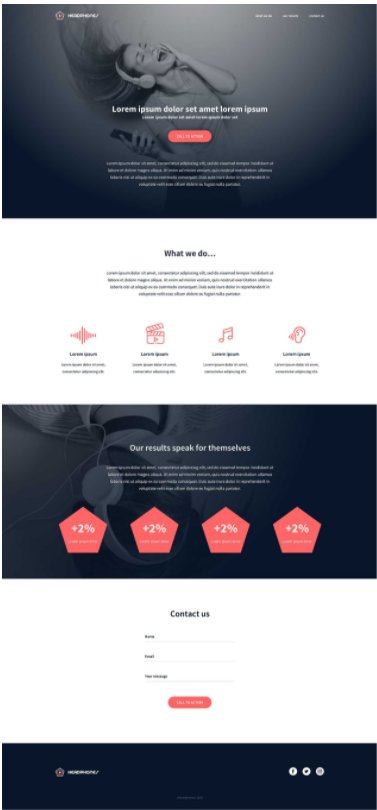

# Holberton Headphones

In this project, I will implement from scratch, without any library, a web page. using all HTML/CSS/Accessibility/Responsive design knowledges learned previously.

The objective is simple: Have a fully functional web page that looks the same as the designer file.



## Installation

Feel free to download and run the file from this repo:
https://github.com/Julianeme/holberton-headphones.git

```bash
pip install foobar
```

## Usage

Just run the index.html file on your own server and modify / remove the files or 
lines you wish to have the final result you want

## Contributing
Pull requests are welcome. For major changes, please open an issue first to discuss what you would like to change.


## License
[MIT](https://choosealicense.com/licenses/mit/)